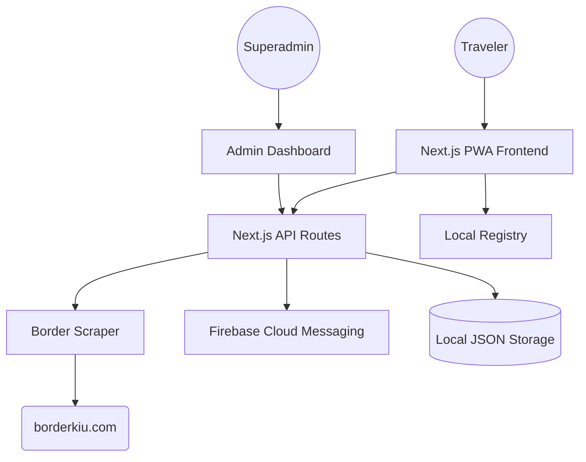

# Border Tracker - System Design & Architecture

## 🏗️ System Architecture

Border Tracker is built as a modern **Next.js 16 Web Application** with a serverless-friendly architecture, utilizing **Firebase** for cloud services and **Leaflet** for geospatial visualization.

### Core Technology Stack
- **Frontend**: Next.js 16 (App Router), React 19, Lucide Icons, Framer Motion.
- **Styling**: Tailwind CSS (Mobile-First, Glassmorphism aesthetic).
- **Mapping**: Leaflet + React Leaflet (Real-time queue visualization).
- **Backend Logic**: Node.js Serverless Functions (Next.js API).
- **Communication**: Firebase Cloud Messaging (FCM) for Push Notifications.
- **Persistence**: 
    - `src/data/tokens.json`: Registry for FCM tokens.
    - `localStorage`: Traveler nicknames and theme preferences.

---

## 🎨 System Design

### 1. Data Flow Patterns
The system operates on an **On-Demand Intelligence** pattern:
- **Client Polling**: The frontend requests `/api/border` every 5 minutes.
- **Server Extraction**: The API scrapes `borderkiu.com`, parses HTML using regex (optimized for performance), and returns structured JSON.
- **Proactive Alerts**: If a border queue exceeds **30 minutes**, the server automatically triggers a push notification to all registered tokens.

### 2. UI/UX Principles (ALESA Standard)
- **Native Feel**: Using `100dvh` and safe-area insets for mobile users.
- **Visual Cues**: Color-coded statuses (Smooth < 30m, Moderate 30-60m, Congested > 60m).
- **Interactivity**: Micro-animations for tab switching and chat interactions.

---

## 🔄 Core Workflows

### A. Real-time Monitoring Workflow
1. **Trigger**: Component mounts or 5-minute timer fires.
2. **Request**: Frontend calls `GET /api/border`.
3. **Execution**: API fetches HTML from 4 border portals sequentially.
4. **Processing**: RegEx extracts "HR/MIN" and "Last Updated" metadata.
5. **Validation**: If Congestion detected -> Notify `notification-service.ts`.
6. **Response**: JSON returned to UI.
7. **Display**: Update `QueueCard` and `QueueMap` markers.

### B. Community Chat Workflow
1. **Initiation**: User sets a nickname (saved to `localStorage`).
2. **Input**: User sends a message (Antispam: 5-second cooldown).
3. **Transmission**: Message sent to state (Current: Stateless; Future: Firebase).
4. **Moderation**: Admin can delete flagged messages from the dashboard.

### C. Admin & Push Workflow
1. **Authentication**: Managed via `LoginPortal` (Superadmin password).
2. **Broadcast**: Admin enters Title/Message.
3. **Loop**: API reads `tokens.json`, iterates through subscribers.
4. **Delivery**: FCM sends payload to iOS/Android/Chrome devices.

---

## 🚀 Future Roadmap (Planning)
1. **Firestore Migration**: Replace local JSON/State with real-time database for Chat & Tokens.
2. **Edge Scraping**: Move scraper to Edge Runtime for lower latency.
3. **Analytics Integration**: Track actual user sessions and border popularity.
4. **Camera Integration**: Feed direct CCTV images from border portals.
